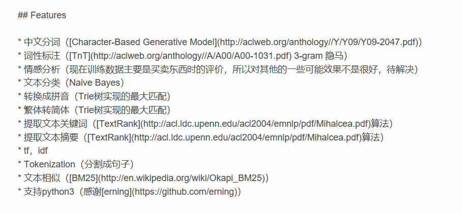

## 使用selenium爬取天猫近视眼镜片评论和销售情况并分析

***

> #### 内容简介：先进行数据采集，获取商品数据后再根据商品url拼接评论内容url，通过评论url获得评论数据，最后进行数据分析

### 1. 数据收集

>采用selenium

<div align="center">
</img>
</div>

#### 得到的商品url

https://list.tmall.com/search_product.htm?q=%BD%FC%CA%D3%D1%DB%BE%B5%C6%AC&type=p&spm=a220m.1000858.a2227oh.d100&from=.list.pc_1_searchbutton


#### 换页条

<div align="center">
</img>
</div>

#### 点击第三页后的商品url

https://list.tmall.com/search_product.htm?spm=a220m.1000858.0.0.3888589de9xg9o&s=120&q=%BD%FC%CA%D3%D1%DB%BE%B5%C6%AC&sort=s&style=g&from=mallfp..pc_1_searchbutton&type=pc#J_Filter

> 分析：相比第一页多了一个s参数，s=120，接着跳转到80页，得到的url中参数s=4740  
所以可以通过s参数换页获取到不同商品信息，s=(页数 - 1)×60  


```
for page in range(1, 78):
    s = (page - 1)*60
    search_url = "https://list.tmall.com/search_product.htm" + "?cat=50041298&s=" + str(s)\
                 + "&q=%BD%FC%CA%D3%D1%DB%BE%B5%C6%AC&sort=s&style=g&from=mallfp..pc_1_searchbutton&active=2" \
                   "&industryCatId=50041298&spm=a220m.1000858.0.0.2f4e58981G3iTJ&type=pc#J_Filter "
    cat_spider = CatSpider(url=search_url)
    cat_spider.get_goods_info(page=page)
    print(search_url)
    sleep(6 + randint(1, 4))
```
> 为了防止触发天猫的反爬虫，加了一个随机等待时间

#### 在获取到商品数据后，根据商品地址拼接商品评论url

>商品url如下  
http://detail.tmall.com/item.htm?id=565334203629&skuId=4063956831708&areaId=430100&user_id=3355869104&cat_id=50041298&is_b=1&rn=1f4a2c261ac23e5987794fcc03e7a9c7  
分析  
id：商品id   
user_id：卖家id   

>当点击商品评论的下一页时，商品的url并没有变化，说明评论数据的更新是通过Ajax获取  

利用开发者工具查看Ajax请求的地址

<div align="center">
</img>
</div>

评论请求的url

<div align="center">
</img>
</div>

>根据网上的资料分析：  
评论数据url https://rate.tmall.com/list_detail_rate.htm?itemId=39310588779&sellerId=775323974&currentPage=1&callback=jsonp1210  
其中  
itemId：商品id   商品url 的 id  
sellerId：卖家id  商品url中的user_id  
currentPage：页码  
callback：  
作为回调函数的一部分，返回的是json格式数据，“callback=jsonp”这部分是固定不变的，后面的数字利用random函数生成一个随机数拼接上去

利用parse解析出商品url中的参数

```
url_param = good_info.split('?')
res = parse.parse_qs(url_param[1])
url_str = 'https://rate.tmall.com/list_detail_rate.htm?itemId=' + ''.join(res['id']) + '&sellerId=' \
          + ''.join(res['user_id']) + '&currentPage=1&callback=jsonp' + str(randint(1000, 20000))
urls_str.append(url_str)
```

   访问100多个页面后，会遇到访问验证，此时服务器返回的json是固定的，包含极验验证的地址，获取地址后，跳转到该地址，获得滑块对象，通过开发者工具可以很容易看到滑动条长度为300px，接着杜撰一个滑动轨迹，（这里我是参考了《python网络爬虫实战》里的模拟验证，但其实没什么用，最后还是自己根据我验证通过的经验，模拟了一个轨迹），开始验证直至验证通过(最开始成功过几次，后来再也没成功过)。

<div align="center">
</img>
</div>

<div align="center">
</img>
</div>

>遇到的问题：  
多次访问后，（大概访问100多个页面）就会触发阿里的反爬虫，第一次需要登录后，再滑动验证，天猫和淘宝采用的都是第三代极验验证，号称采用机器学习识别轨迹，实测真的很坑，在前几次验证还可以通过，验证多次后感觉难度越来越大，基本不可能通过，就算是人工验证也不鸟你。只有等过几个小时，才会解封。  


### 2. 数据处理

爬取到的商品数据

<div align="center">
</img>
</div>

爬取到的商品评论数据

<div align="center">
</img>
</div>


### 3. 数据可视化分析

1. 销售眼镜度数规格分析(matplotlib + json + re)

>##### 从用户购买的情况分析近视度数的分布情况

- 通过json在线解析，分析json内容

- 读取excel中的json数据并解析

>有的数据json格式有错误，需要捕获异常跳过  

```
try:
    dict_data = json.loads(json_data, strict=False)
    for json_item in dict_data['rateDetail']['rateList']:
        if json_item['appendComment'] is not None:
            appand_comment_count = appand_comment_count + 1
            f.write(json_item['appendComment']['content'] + "\n")
        comment_time = json_item['rateDate'].split()[0]  # 评论日期
        dushu = json_item['auctionSku'][json_item['auctionSku'].index('镜片适合度数') + 7:]
        dushu = re.findall(r"\d+\.?\d*", dushu)  # 提取度数
        dushus.append(dushu)
        comment_time_list.append(comment_time)
        count = count + 1
except Exception:
    continue
```
```dushus```保存的是所有眼镜片销售的度数规格  
```comment_time_list```保存的是所有评论的日期

<div align="center">
</img>
</div>


2. 评论日期分析

>##### 分析网购的规律

<div align="center">
</img>
</div>

>分析可以发现销量最高一天为11月19号，这个比较符合实际规律，双11销量比较高（考虑快递时间）。


3. 追加评论情感分析(snowNLP)

>##### 从追评的角度分析网购眼镜片的可靠性

<div align="center">
</img>
</div>

>如果有追加评论的话，那么aooendComment字段不为None  
在json字符串解析时顺便将追评保存到AppendComment.txt


```
if json_item['appendComment'] is not None:
	appand_comment_count = appand_comment_count + 1
    f.write(json_item['appendComment']['content'] + "\n")
```

AppendComment.txt

<div align="center">
</img>
</div>

代码：

```
from snownlp import SnowNLP
import matplotlib.pyplot as plt

file = "appendComment.txt"  # 评论数据文件
bad = "bad.txt"  # 差评保存文件
good = "good.txt"
comment_dict = {}
z = 0  # 总数
with open(file, "r", encoding="gbk", errors='ignore') as text:
    bad = open(bad, "w", encoding="utf-8")
    good = open(good, 'w', encoding='utf-8')
    for comment in text:
        z += 1
        s = SnowNLP(comment)  # 文本分析
        s = s.sentiments  # 情感系数
        if s >= 0.66:
            good.write(comment)
            comment_dict['好评数'] = comment_dict.get('好评数', 0) + 1
        elif 0.66 > s > 0.33:
            comment_dict['中评数'] = comment_dict.get('中评数', 0) + 1
        else:
            bad.write(comment)  # 写入差评数
            comment_dict['差评数'] = comment_dict.get('差评数', 0) + 1
    bad.close()
    good.close()
for a, b in comment_dict.items():
    pctb = b/z*100
    # ha 文字指定在柱体中间， va指定文字位置 fontsize指定文字体大小
    plt.text(a, b + 0.05, '%.0f%%' % pctb, ha='center', va='bottom', fontsize=11)
# 设置X轴Y轴数据，两者都可以是list或者tuple
x_axis = tuple(comment_dict.keys())
y_axis = tuple(comment_dict.values())
plt.bar(x_axis, y_axis, color='rgb')  # 如果不指定color，所有的柱体都会是一个颜色

plt.savefig("cat_spider_img\\append_comment_analyze.png")  # 保存为图片
plt.show()
print(comment_dict)

```

最后得到评论总数 37309 追评数 3638

情感分析结果

<div align="center">
</img>
</div>

好评结果

<div align="center">
</img>
</div>

差评结果

<div align="center">
</img>
</div>


